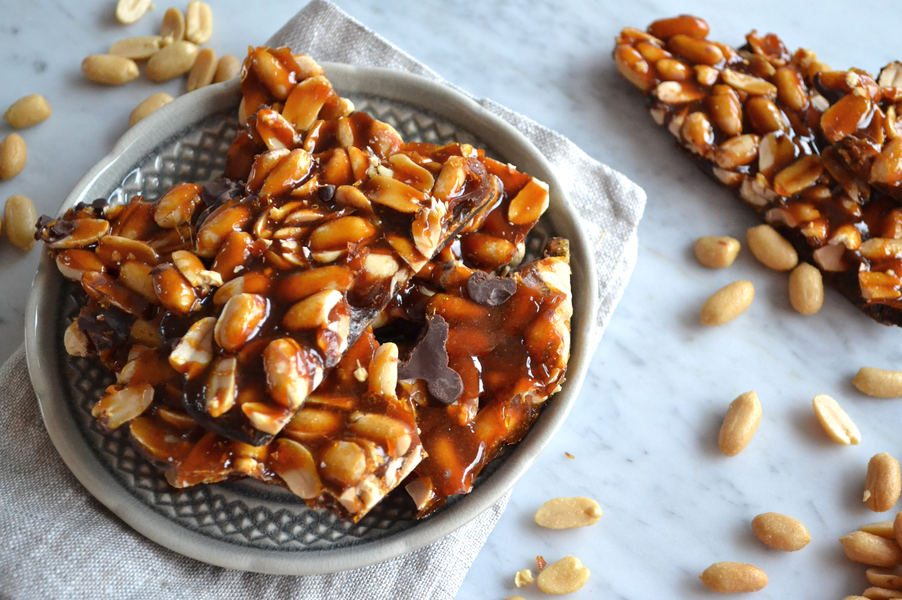

---

# What makes a layout "brittle"?

--
count: false

## Not this

---
count: false

# What makes a layout "brittle"?

## But this

> ### easily damaged or destroyed

--
count: false
> ### fragile

--
count: false
> ### breaking readily

---
count: false

# What makes a layout "brittle"?

## Let's explore:

### https://cdpn.io/pen/b3c8cc66d0067ca5124f8285963374f1

