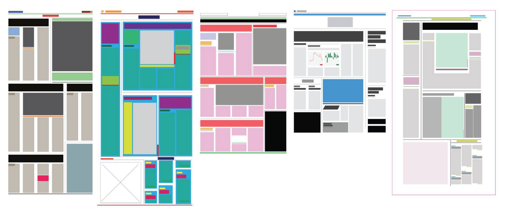

---

# Structural analysis

.cf[.left-float[
- `header`
- `footer`
]
.right-float[
- `main`
- `nav`
]]

--
count: false

- Identity structural elements
- Note elements you struggle to label

???
- @timer=
- partner up and take 10m to explore some web sites with these elements in mind
  - content-heavy sites vs ones _only_ visual
- what structural elements can you identify?
    - don't look at the markup yet!
- which elements do you struggle to label?
    - check markup: ⬅️ make sure everyone knows how to do this
      - agree/disagree?
      - if element is unfamiliar, look it up in MDN
- send me a link via DM in Slack to a site you want to present and discuss
- will post these instructions to the #general channel of Slack
- @timer=

---

???
- We'll dive more deeply into the sites you reviewed in a few, but first: how hard was it to identify the elements that make up the page?
- What made it difficult?
- Did you learn any new HTML elements?

---

# Structural analysis, part II

- Recreate the site layout structure using no text, no images
    - Only colors and simple geometric shapes

???
- Using the software of your choice (e.g., InDesign, Illustrator or Sketch), recreate the layout structure of the site you explored
- Express the structure only using simple geometric shapes for the contents (e.g., header with thick black line, body text with thin grey line, image with green rectangular box, etc)
- Do not write any text or use any images
- Send me a DM with a a screenshot of the site you're working from and upload a JPG/PNG/GIF of your version of its layout structure
- https://github.com/cdaein/mica-gd220/blob/spring2019/lectures/w1-structure-analysis.md
- @timer=
- take an additional 10-15m to go through examples and discuss
  - what does the site do design-wise to communicate these elements and its hierarchy?
  - what does the abstraction/wireframe make more clear about the site?
- @timer=
- @break for dinner?

--
count: false

