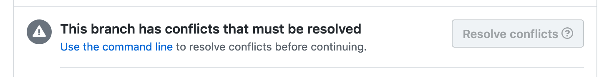

# Wrapping Project 1

## First question

Do you want to update your project based on my feedback?

### ✅ Yes
- Take notes, but no action

### 🚫 No
- Carry on to the next step!
 

---
count: false

# Wrapping Project 1

## Next question

Do you have any local changes **not** on GH?

- `git status`
- check source control explorer in VS Code

---
count: false

# Wrapping Project 1

## Next question

Do you have any local changes **not** on GH?

### ✅ Yes
- Commit and push changes, then carry on!

### 🚫 No
- Let's see if we can merge your changes!

---
count: false

# Wrapping Project 1

## Last question

Can we merge?

### ✅ Yes

### 🚫 No

???
If you have conflicts, put up a post-it note on your laptop
- @timer = 5m / 80

---

# Merging Project 1

### https://help.github.com/en/articles/merging-a-pull-request

???
https://help.github.com/en/articles/merging-a-pull-request#merging-a-pull-request-on-github

---

# Merging Project 1

After merging, you're 👌🏻 to delete the branch, too

???
- @timer = 5m / 85

