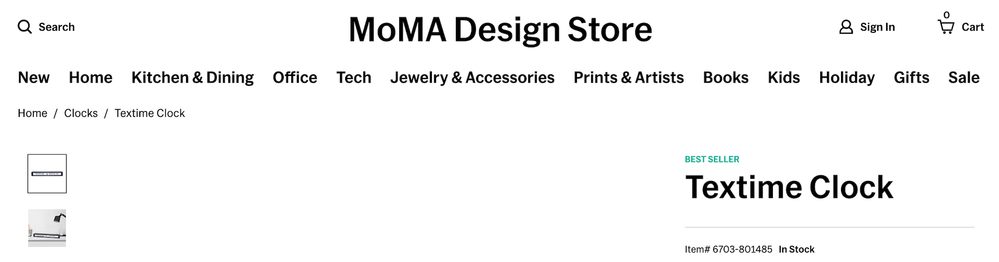
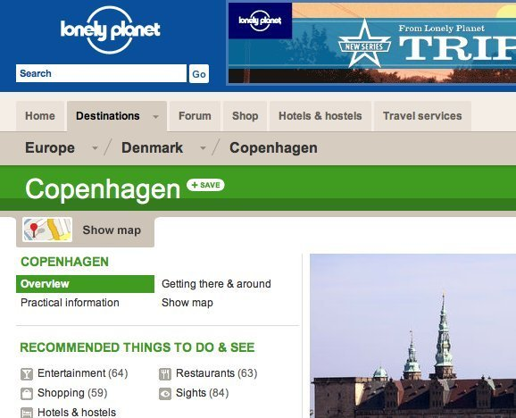
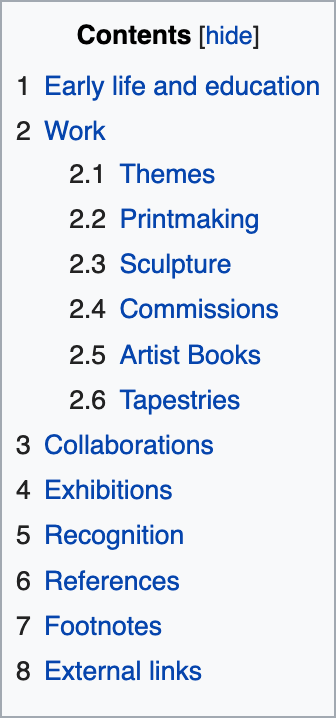
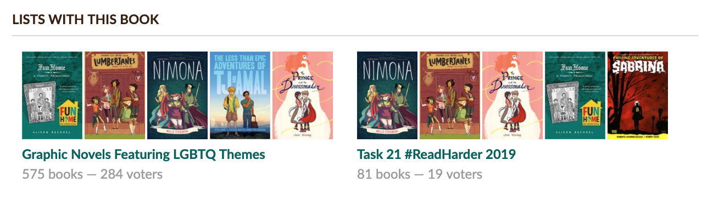
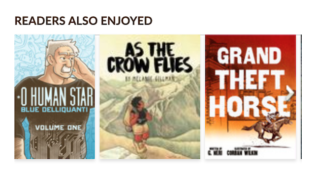
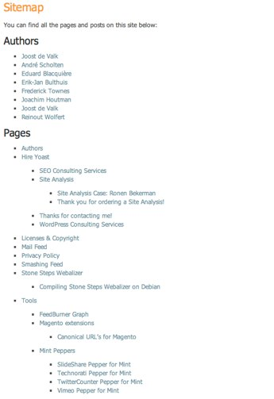
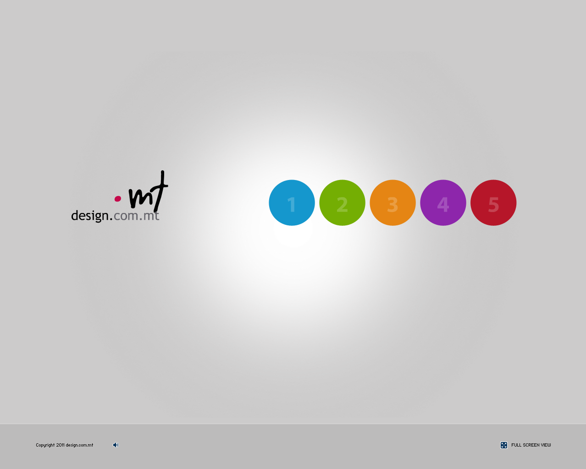
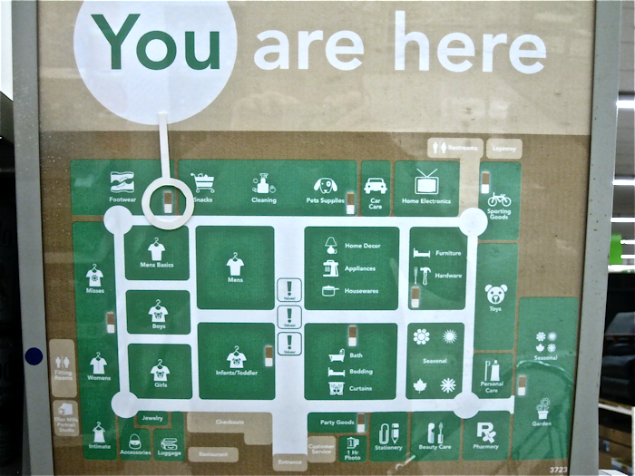
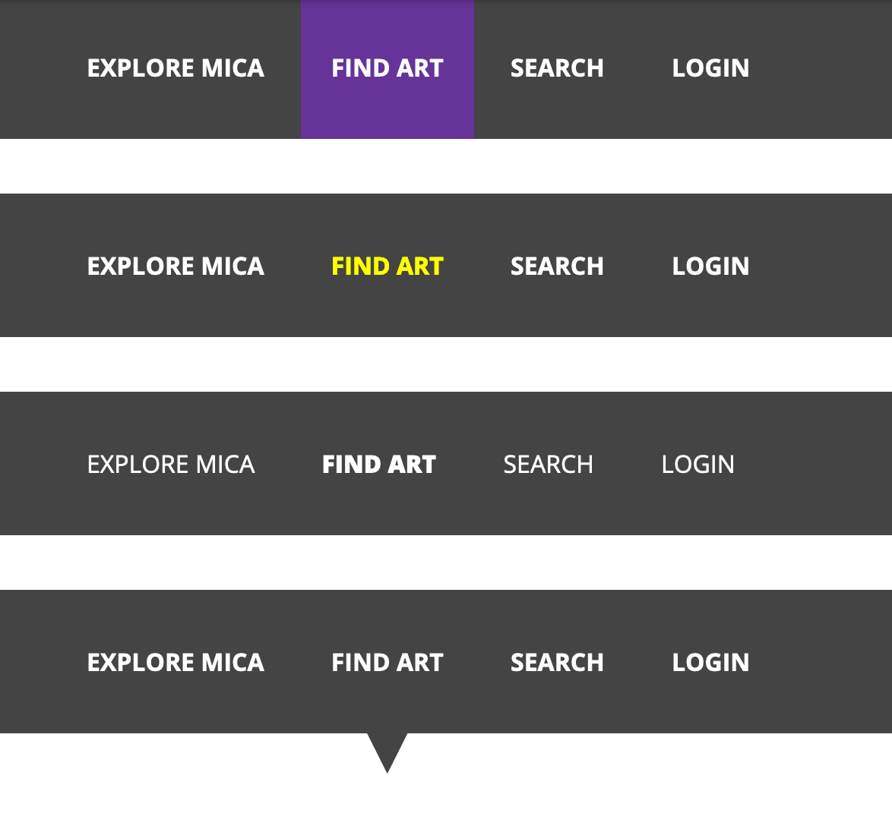

---

# Types of navigation

## Global

???
- Appears consistently across the site
- Can be removed or hidden, however, to minimize distraction at key points (like when someone is making a purchase or filling out a form)
- May include logo and utility links (e.g., my account, search, cart, etc.)
- @timer 2m / 4

---

# Types of navigation

## Global

???
Very often horizontal, but as we all know, it doesn't need to be

---

# Types of navigation

1. Global
2. Secondary

---

# Types of navigation

## Secondary

???
- Only activated after you've landed on an internal page or made a choice from the homepage's global nav

---
count: false

# Types of navigation

## Secondary: Breadcrumbs

???
- @timer 2m / 6

---

# Types of navigation

## Secondary: Jump Links

???
- @timer 2m / 8

---

# Types of navigation

1. Global
2. Secondary
  - Breadcrumbs
  - Jump Links

---

# Types of navigation

## Associative & Adaptive

???
- associative: tags, categories, other lists with this book in it
- adaptive: responding to user input, like top or similar reads
- @timer 2m / 10

---

# Types of navigation

1. Global
2. Secondary
  - Breadcrumbs
  - Jump Links
3. Associative
4. Adaptive

---

# Types of navigation

## Sitemap

???
- Varied levels of how exhaustive they are or how well organized (if at all)

---

# Types of navigation

1. Global
2. Secondary
  - Breadcrumbs
  - Jump Links
3. Associative
4. Adaptive
5. Sitemap

---

# Mobile navigation

## Gestures

???
- need to be learned and discovered
- more universal than icons

---
count: false

# Mobile navigation

## Gestures

???
- most well known and succesful example
- @timer 2m / 17

---

# Mobile navigation

## Tab bar

???
- Minimal space (~5 options)
- Right at your thumb
- @timer 3m / 13

---

# Icons can be ambiguous

.center[

]

???
Even **familiar** icons can be confusing or ambiguous:
- Pencil. Write or edit?
- Magnifying glass. Zoom or search?

---
count: false

# Icons can be ambiguous

???
- Plus. Add item or expand?
- Minus. Remove item or collapse?
- x. Close or delete?
- Caret. Play, go or slide right?

--
count: false

## Opt to do icons + text

???
- Icons + text almost always
- Example from: https://www.smashingmagazine.com/2014/10/wayfinding-for-the-mobile-web/#using-icons

---

# Icons can be ambiguous

---

# Mobile navigation

## Hamburger

???
- Low discoverability
- Gaining familiarity
- Only use if the page has other ways to achieve main actions
- @timer 2m / 15

---

# Types of navigation

## Mystery Meat

???
- @timer 3m / 20

---

# Types of navigation

## "You are here"

---
count: false

# Types of navigation

## "You are here"

???
- Users may not enter on the homepage, navigation is critical to them knowing where they are and finding their way
- Keep in mind that users will miss subtlety here

- background color
- color change
- font weight change
- pointer
- @timer 4m / 24
- Q&A about types of nav
- @timer 2m / 26

---

# Common goals of navigation

## Where am I?

???
- Landmarks to ground the user: site logo, global nav, breadcrumbs, page/section titles

--
count: false

## ...in relation to other things?

--
count: false

## Where can I go?

???
- @timer 2m / 28

---

# Less-obvious functions of navigation

## What's present/possible?

???
By making the hierarchy visible, nav functions like a table of contents -- not just where I can go, but what is encompassed within the site's boundaries

--
count: false

## How do I use this site?

???
- Structure of nav implies where to begin and what order to do things

--
count: false

## How confident am I in the site/its creators?

???
- Clear, approachable nav builds confidence and trust
- @timer 3m / 31

---

# Wayfinding

???
We've talked mostly about what we provide to users--navigation. Let's jump back to the user experience of wayfinding for a few.

--
count: false

## Two types of users

???

- Looking for something in a store with my brother, I'll always be confident I can find a thing, he always looks for someone to ask; these same patterns exist on the web: link-dominant vs search-dominant behaviors; need to consider both

--
count: false

- ### link-dominant
- ### search-dominant

???

- Unlike a store, a web site has no sense of scale vs a store or museum
- No sense of direction
- Little sense of location; no "along the way" placemarkers
- @timer 3m / 34

---

# Additional Considerations

- ## Wording of navigation labels

???
- Think about how terms a user might search for (no one searches for "services," "products")
- Think about topics not formats

--
count: false

- ## Organization of navigation items

???
- Group and chunk info, helps with scanability, navigation and memory

--
count: false

- ## Navigation conventions

???

- Consistency: Ever been in a city where street signs are a different color or are in a different location than you expect? Is that delightful or just painful?
- User frustration over conventions/expectations
- @timer 3m / 37

---
class: center, middle, title
count: false

# Q&A

???

- Not an exhaustive survey of navigation -- more complex nav patterns exist, but should be reserved for truly complex needs -- not just leaned on b/c team or client doesn't want to prioritize nav options for users
- @timer 5m / 42

---

# Quick navigation test

- ID this site
- What page am I on?
- What are the major sections of this site?
- What are my options at this level?
- Where am I in the scheme of things?
- How can I search?

???
- do 3 of these; @timer 10m / 52
