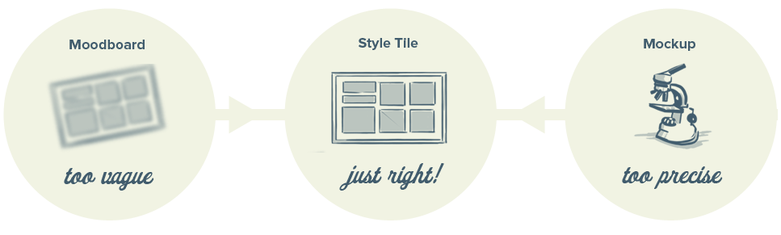
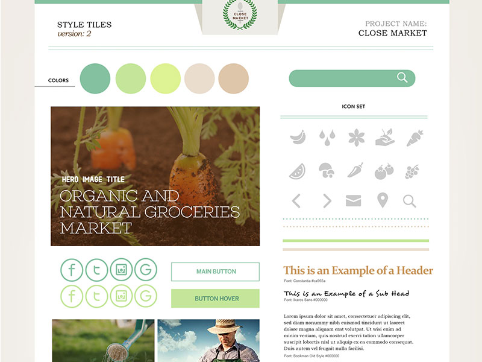
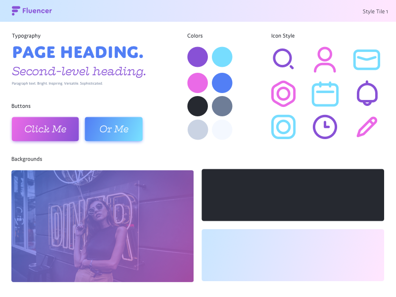
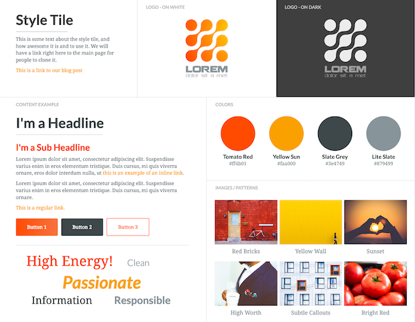

# Style tiles

???
Have folks used moodboards in design before? Experiences? Pros? confusing?

--
count: false

???
- like a moodboard for web design
- but collage nature of moodboard is more informal
- selection of visual components in a design
- building blocks for complete design
- initial representation of brand feel: old fashioned vs trendy, quirky vs minimal
- iterative without having to do a complete comp, able to dial in

---
count: false

# Style tiles

---
count: false

# Style tiles

---
count: false

# Style tiles

---
count: false

# Style tiles

## Learn more

### http://styletil.es/
